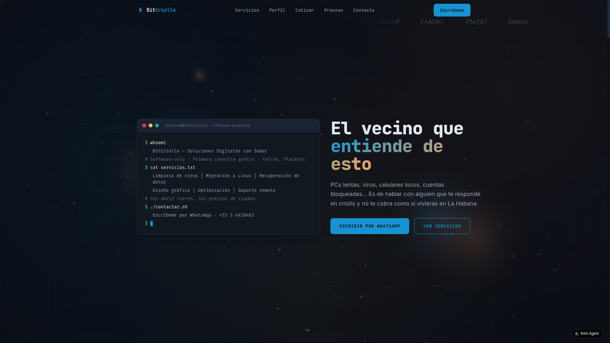

# BitCriollo 🖥️

[](https://bitcriollo.pages.dev)
[](https://reactjs.org/)
[](https://www.typescriptlang.org/)
[](https://tailwindcss.com/)

**BitCriollo** es el sitio web profesional de **Norland Chávez**, técnico informático independiente en Falcón, Placetas, Villa Clara. Es un espacio que combina la oferta de servicios técnicos con un blog personal (**DIUA** — *Diario de un Informático Universitario y Artista*), reflejando la fusión entre tecnología, arte y la realidad cubana.



✨ **Live Demo**: [bitcriollo.pages.dev](https://bitcriollo.pages.dev)

---

## 🚀 Características

### Core del sitio
- **Landing Page** con terminal interactiva y diseño moderno.
- **Cotizador de servicios** en CUP (Pesos Cubanos).
- **Secciones informativas**: Perfil, Servicios, Proceso de trabajo, Stack tecnológico.
- **Formulario de contacto** integrado con métodos directos (WhatsApp, Telegram, Email).

### Novedades v1.1 (Actual)
- 🌗 **Tema claro/oscuro**: Cambio dinámico con persistencia en `localStorage` y respeto por las preferencias del sistema.
- 🧭 **Enrutamiento completo**: Navegación entre páginas independientes (`/servicios`, `/blog`, `/perfil`, etc.) usando React Router.
- 📝 **Blog DIUA integrado**: Artículos cargados desde archivos **Markdown** (`src/content/blog/`). Soporte para etiquetas, fechas y vista de lectura optimizada.
- 🎨 **Diseño consistente**: Interfaz unificada con tipografías `JetBrains Mono` e `Inter`, y animaciones suaves.

---

## 🛠️ Stack Tecnológico

| Tecnología | Propósito |
|------------|-----------|
| **React 19** | Biblioteca principal para la UI. |
| **TypeScript** | Tipado estático para un código más robusto. |
| **Vite** | Bundler ultrarrápido y servidor de desarrollo. |
| **React Router v6** | Manejo de rutas y navegación SPA. |
| **Tailwind CSS 3.4** | Estilizado con clases utilitarias y tema personalizado. |
| **shadcn/ui** | Base para componentes UI accesibles. |
| **GSAP + ScrollTrigger** | Animaciones avanzadas al hacer scroll. |
| **react-markdown + remark-gfm** | Renderizado de los posts del blog desde Markdown. |
| **gray-matter** | Parseo del frontmatter de los archivos .md. |
| **Lucide React** | Iconografía ligera y consistente. |
| **Cloudflare Pages** | Alojamiento y despliegue continuo (CI/CD). |

---

## 📂 Estructura del Proyecto (v1.1)

```
src/
├── components/
│   ├── Layout.tsx           # Layout principal (Nav + Footer)
│   ├── Navigation.tsx       # Menú responsive con enlaces y ThemeToggle
│   ├── Footer.tsx           # Pie de página con enlaces sociales
│   └── ThemeToggle.tsx      # Botón de cambio de tema
├── context/
│   └── ThemeContext.tsx     # Proveedor de tema claro/oscuro
├── content/
│   └── blog/                # 📝 Archivos .md del blog DIUA
│       └── bienvenida.md    # Post de ejemplo
├── lib/
│   └── posts.ts             # Utilidades para leer y parsear los posts
├── pages/                   # 🧭 Páginas independientes
│   ├── Home.tsx
│   ├── Servicios.tsx
│   ├── Proceso.tsx
│   ├── Stack.tsx
│   ├── Contacto.tsx
│   ├── Perfil.tsx
│   ├── Blog.tsx             # Listado de entradas
│   └── BlogPost.tsx         # Vista de artículo individual
├── sections/                # Secciones reutilizables (sin cambios)
│   ├── Hero.tsx
│   ├── Perfil.tsx
│   ├── Servicios.tsx
│   ├── Cotizador.tsx
│   ├── Proceso.tsx
│   ├── Stack.tsx
│   ├── LaVallita.tsx
│   └── Contacto.tsx
├── App.tsx                  # Definición de rutas
├── main.tsx                 # Punto de entrada con providers
├── index.css                # Estilos globales y variables CSS
└── vite-env.d.ts            # Declaraciones de tipos
```

---

## 🏁 Instalación y Desarrollo

Sigue estos pasos para ejecutar el proyecto localmente:

```bash
# 1. Clonar el repositorio
git clone https://github.com/Dragoland/bitcriollo.git
cd bitcriollo

# 2. Instalar dependencias (incluye las nuevas de v1.1)
npm install

# 3. (Opcional) Si usas el script de actualización automática:
chmod +x setup.sh
./setup.sh

# 4. Iniciar el servidor de desarrollo
npm run dev
```

Abre `http://localhost:5173` para ver el sitio en acción.

---

## 📝 Cómo añadir una entrada al blog (DIUA)

1. Crea un archivo `.md` dentro de `src/content/blog/`.
2. Añade el **frontmatter** al inicio del archivo:
   ```yaml
   ---
   title: Título de tu post
   date: 2026-07-15
   tags: [linux, tutorial, python]
   excerpt: Breve descripción del artículo (opcional)
   ---

   Contenido en **Markdown** aquí...
   ```
3. El blog lo detectará automáticamente y aparecerá en la lista de `/blog`.

---

## 🤝 Contribuir

Si encuentras algún bug o tienes sugerencias, no dudes en abrir un **Issue** o un **Pull Request**. Toda ayuda es bienvenida.

---

## 📜 Licencia

Este proyecto es de código abierto bajo la licencia **MIT**.

---

## 📬 Contacto

- **Telegram**: [@diario_del_informatico](https://t.me/diario_del_informatico)
- **GitHub**: [@Dragoland](https://github.com/Dragoland)
- **Web**: [bitcriollo.pages.dev](https://bitcriollo.pages.dev)

---

> Hecho con ❤️ y ⌨️ desde Falcón, Placetas, Villa Clara, Cuba.
